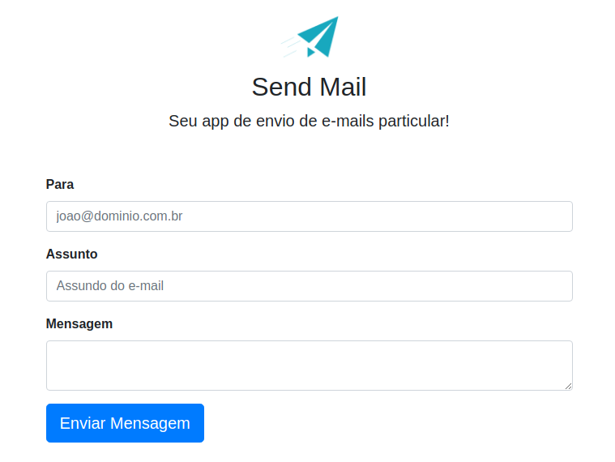

# App SendMail

---

  

 
  
      
          
          
          

    <a href="#speech_balloon-sobre">Sobre</a>&nbsp;&nbsp;&nbsp;|&nbsp;&nbsp;&nbsp;
    <a href="#hammer_and_wrench-tecnologias">Tecnologias</a>&nbsp;&nbsp;&nbsp;|&nbsp;&nbsp;&nbsp;
    <a href="#gear-requisitos">Requisitos</a>&nbsp;&nbsp;&nbsp;|&nbsp;&nbsp;&nbsp;
    <a href="#scroll-licença">Licença</a>&nbsp;&nbsp;&nbsp;&nbsp;&nbsp;&nbsp;    

### :speech_balloon: Sobre

O desenvolvimento de uma aplicação para envio de email utilizando recursos do PHP neste projeto prático realizado durante o curso de desenvolvimento web.

### :hammer_and_wrench: Tecnologias

- HTML
- CSS
- Git
- PHP

### :gear: Requisitos

Para rodar a página

- Baixe para sua máquina
- Instale o Xampp
- Você precisa ativar o servidor do xampp e depois abrir o projeto no localhost da pasta hdocs do xampp e rodar em seu navegador

### :scroll: Licença

Esse projeto está sob a licença [MIT](https://github.com/wevdiaz/App_SendMail/blob/main/LICENSE)

Projeto desenvolvido pelo instrutor [Jorge Sant Anna](https://jorgesantana.net.br/) durante o curso desenvolvedor web
